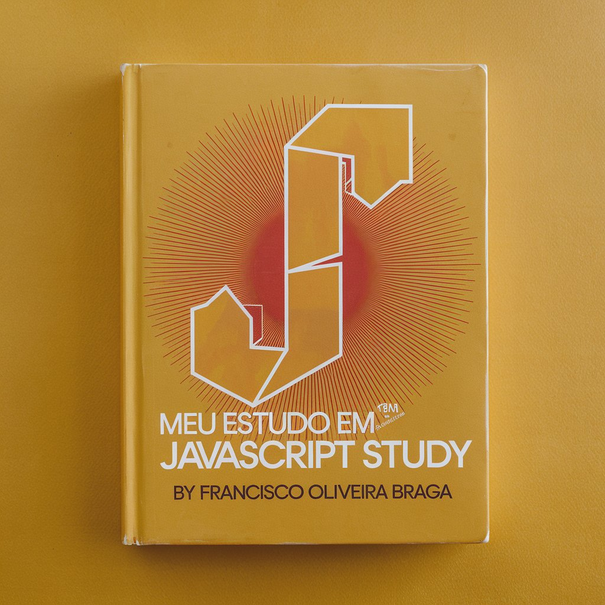

# Meu Curso JavaScript 

## Súmario

[Variáveis](https://github.com/FranciscoBraga/javascript_exercicios/blob/main/exerc%C3%ADcios/variaveis.html)

### comentário

Este é um simples projeto de HTML com JavaScript incorporado, que demonstra o uso do Javascript. Com ajuda de diferentes cursos que fiz 👨‍🎓👨🏾‍🎓, livros 📚📕📖 e o chat gpt 🤖.

